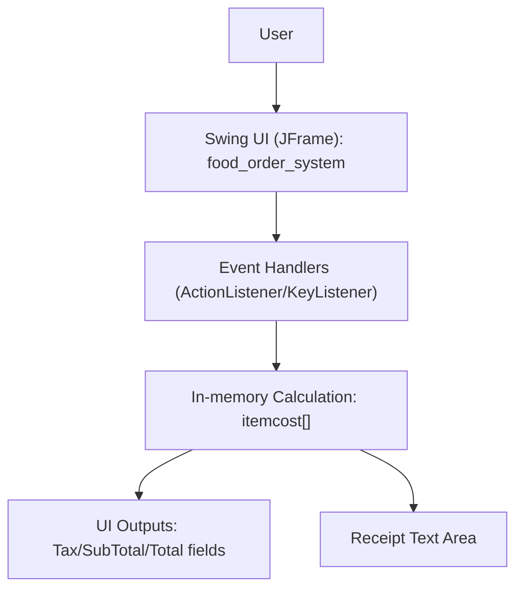
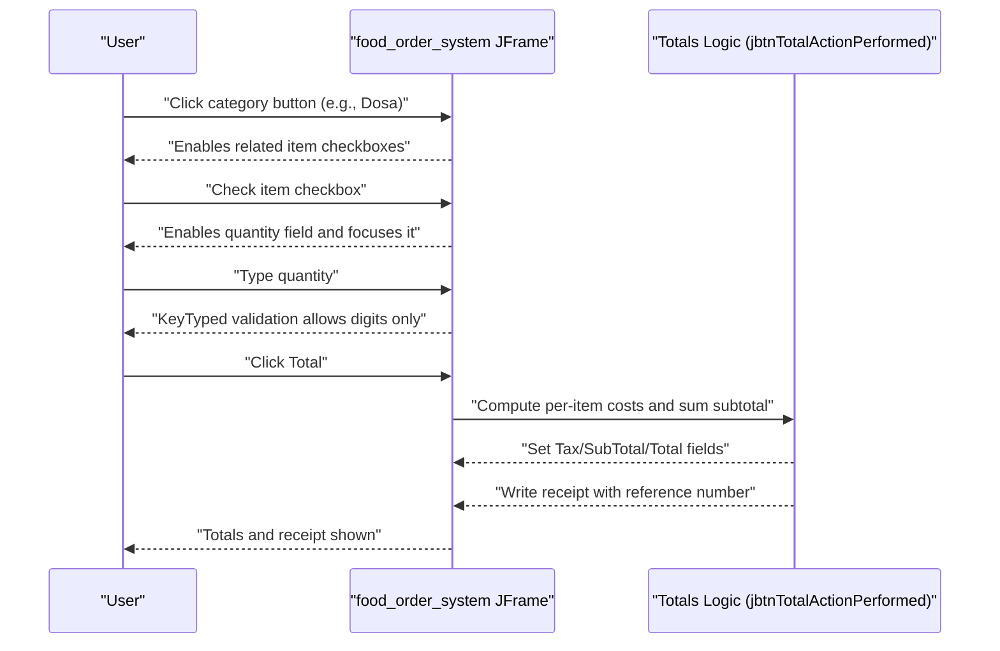

# Food Order System (Java Swing) - Technical Specification

## 1. Purpose

This application is a Java Swing desktop food ordering system built with NetBeans. It allows a user to select menu items across multiple categories, enter quantities, calculate a subtotal, apply a fixed tax rate, and display the final total. After calculation, the application generates a simple on-screen receipt containing a randomly generated reference number.

The system is a standalone GUI application with no server-side component, no network communication, and no persistent database storage. All calculations occur in memory and are driven by user interactions with the Swing UI.

## 2. High Level Architecture

The application is implemented as a single Java SE Swing window (`JFrame`) that contains all UI controls and business logic. The NetBeans GUI Form Editor generates most of the UI construction code (`initComponents()`), while event handlers implement the application behavior.

At a high level, the runtime architecture consists of:

1. The Java Runtime launching the application entry point (`main`).
2. Swing setting the Look and Feel (Nimbus if available).
3. The Event Dispatch Thread (EDT) creating and showing the main frame.
4. User actions (checkbox toggles, text entry, and button clicks) triggering event handlers.
5. Event handlers performing validation, cost calculation, tax calculation, and receipt rendering.

## 3. Modules Brief

Although the project is not split into multiple packages/modules, it can be described in logical modules implemented within a single class.

### 3.1 Application Entry and UI Bootstrapping

The `main` method sets the Nimbus Look and Feel when available and then schedules creation of the window on the Swing Event Dispatch Thread using `EventQueue.invokeLater`. This ensures Swing components are created and updated on the correct thread.

### 3.2 UI Layout and Components (NetBeans Form Editor)

The `initComponents()` method (generated by NetBeans) declares and lays out:

1. Category buttons (Dosa, Punjabi, Chinese, Fast Food, Pizza, Soft Drink).
2. Menu item checkboxes with corresponding quantity text fields.
3. Totals panel containing fields for Tax, SubTotal, and Total.
4. Receipt text area.
5. Control buttons: Total, Reset, Exit.

The initial enabled/disabled state is also managed so that menu controls are disabled until relevant category buttons are used.

### 3.3 Input Validation (Numeric-only Quantity Fields)

Quantity fields attach `keyTyped` listeners that attempt to ensure only digits can be entered. This is implemented by checking `Character.isDigit` and consuming the event for invalid characters.

The same numeric-only behavior is repeated across many text fields, each with its own handler method.

### 3.4 Category Enablement Logic

Category buttons enable their associated item checkboxes. For example, clicking the Dosa category button enables Dosa item checkboxes. This provides a guided selection flow in the UI.

### 3.5 Item Selection and Quantity Enablement

Each item checkbox toggles the enabled state of the corresponding quantity text field:

1. When selected, the field is enabled, cleared, and focused.
2. When unselected, the field is disabled and reset back to `"0"`.

### 3.6 Totals and Receipt Generation

The Total button triggers a full cost computation:

1. Each item cost is computed as `quantity * unitPrice`.
2. All item costs are summed to produce a subtotal.
3. Tax is computed as a fixed 10% (`subtotal * 0.1`).
4. Total is computed as `subtotal + tax`.
5. Output fields are populated using currency-like formatting with a `Rs` prefix.
6. A receipt is written into the receipt text area including a random reference number.

Important implementation notes based on the current code:

1. The per-item computations are hard-coded; there is no menu data structure or configuration file.
2. The tax rate is fixed at 10% in code.
3. The receipt includes a timestamp formatter setup, but the current receipt text written does not include the formatted time/date; it only includes the reference number and a static thank-you line.

### 3.7 Reset and Exit

The Reset button restores the UI to a default state by:

1. Clearing receipt content.
2. Resetting all quantity fields back to `"0"`.
3. Unselecting all checkboxes.
4. Disabling all checkboxes and quantity fields.
5. Disabling total/tax/subtotal fields and the receipt area.

The Exit button uses `JOptionPane.showConfirmDialog` to confirm user intent and then calls `System.exit(0)`.

## 4. Sequence Diagram

The following sequence diagram describes the primary flow from selecting items through generating totals and a receipt.

## 5. Technical Stack

This project is implemented with the following technical stack:

1. Java SE (source/target configured as 1.6 in NetBeans project properties).
2. Swing for the desktop GUI (`javax.swing`).
3. NetBeans GUI Builder (.form + generated Swing layout code).
4. Apache Ant as the build system (NetBeans-managed Ant scripts).

The application does not include any web framework, API layer, ORM, database connector, or external service integrations.

## 6. 3rd Party Libraries/Dependencies

No external third-party libraries are used by the application code. It relies on Java SE standard libraries only, including:

1. `javax.swing` for the UI components, layout, and dialogs.
2. `java.awt` and `java.awt.event` for events and some UI foundations.
3. `java.text.SimpleDateFormat` and `java.util.Calendar` for time/date formatting.
4. `java.util.logging` for logging exceptions in the Look and Feel setup.

Build and project metadata is handled by NetBeans/Ant project files, but those do not introduce additional runtime dependencies beyond the JRE.

## 7. Logger Used

There is no application-level logging framework configured for normal runtime events (such as user actions or calculation steps).

However, the code uses the Java standard logging API indirectly in the `main` method exception handlers when applying the Nimbus Look and Feel:

1. `java.util.logging.Logger`
2. `java.util.logging.Level`

These are used only to log exceptions if Look and Feel configuration fails.

## 8. Deployment and Usage Manual

### 8.1 Build and Packaging (NetBeans / Ant)

This is a NetBeans Java SE project that uses Ant scripts.

To build a distributable JAR using Ant:

1. Open the project in NetBeans and use the Build action, or
2. Run the Ant build script from the project directory (exact targets may vary by NetBeans setup because `build.xml` imports `nbproject/build-impl.xml`).

The NetBeans project configuration indicates:

1. The main class is `food_order_systems.food_order_system`.
2. The output JAR is configured as `dist/anagrams.jar` in `nbproject/project.properties` (this name appears inherited from a template and may not match the application name).

### 8.2 Run Instructions

Once built, the application can be run in the following ways:

1. From NetBeans: use the Run action, which executes the configured main class.
2. From the command line: run the generated JAR (if it includes the `Main-Class` attribute in its manifest) using:
   - `java -jar <path-to-jar>`

If the JAR manifest does not contain the main class entry, you can run the main class via the classpath (using the compiled classes output) by specifying:
- `java -cp <classpath> food_order_systems.food_order_system`

### 8.3 Usage Guide (End User)

1. Start the application to open the main window.
2. Click a category button (Dosa, Punjabi, Chinese, Fast Food, Pizza, Soft Drink) to enable items in that category.
3. Select one or more items using the checkboxes. Selecting an item enables its quantity field.
4. Enter the desired quantity for each selected item.
5. Click the Total button to compute SubTotal, Tax, and Total, and to generate a receipt.
6. Click Reset to clear the order and return the UI to the initial disabled state.
7. Click Exit to close the application (a confirmation dialog is shown).

### 8.4 Configuration and Environment

The application does not use an `.env` file and does not require environment variables. Menu item prices and the tax rate are hard-coded in the source code.

### 8.5 Operational Notes and Limitations

1. The tax rate is fixed at 10% and is not configurable at runtime.
2. There is no persistence: orders and receipts are not saved to disk.
3. Receipt content is minimal and currently does not print the formatted time/date even though formatters are created.
4. Quantity validation is implemented at the key-typed level and is duplicated across fields; it may not prevent all invalid states such as empty strings if a field is enabled and left blank before Total is pressed.
